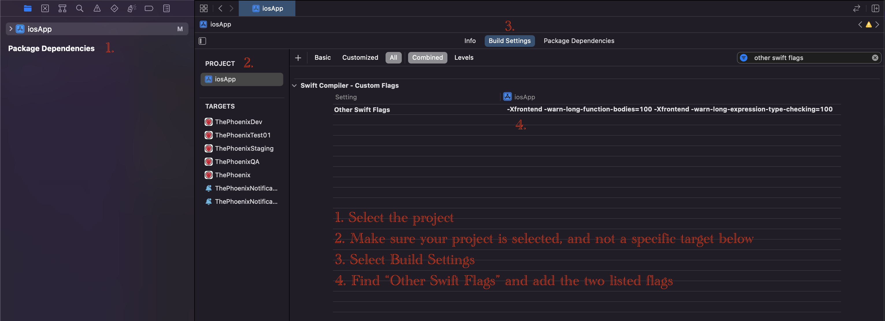

# FIVE iOS Project Settings

These are the official project settings for FIVE iOS Swift projects. 

## Table of Contents
* [Build Time](#build-time)
    * [Functions and expressions](#Functions-and-expressions)

## Build Time

### Functions and expressions
Functions and expressions in the code shouldn't be too complex. That can be ensured by adding two `Other Swift Flags` which will trigger a warning if a function or an expression takes too much time to build.

Those flags are:
1. `-Xfrontend -warn-long-function-bodies`
2. `-Xfrontend -warn-long-expression-type-checking`

Both flags receive a value in milliseconds, which represents a build time limit. Suggested limit is `100ms` for both flags. The warning is displayed if that limit is exceeded.
If the warning is displayed, a function or an expression should be decoupled into smaller logical components, resulting in a less complex and more readable code.

