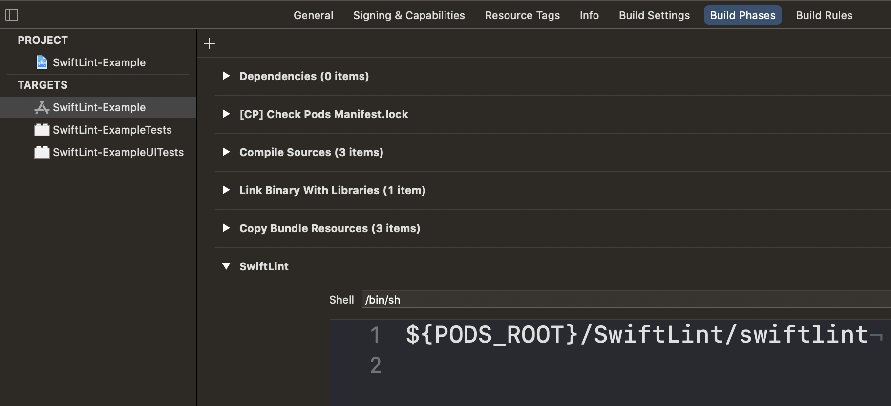
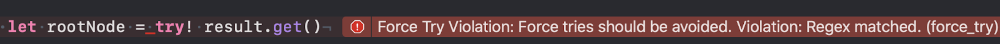
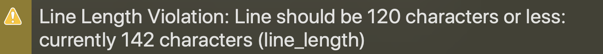

# FIVE iOS SwiftLint Rules

## Table of Contents

* [Overview](#overview)
* [Code Style](#code-style)
* [Integration into a project](#integration-into-a-project)
* [Example](#example)

## Overview

SwiftLint is a tool to enforce Swift style and conventions.

Main benefits of linting a Swift code:
* It helps to onboard a new developer and follows FIVE iOS code style guide.
* SwiftLint will warn a developer if the code style guide is not followed, and improve code consistency across FIVE iOS codebases.
* Can help reduce the number of common mistakes, e.g. strong `self` in closures 💪
* Reduce the number of stylistic comments on pull requests, as build checks will surface such mistakes even before anybody looks at a pull request. 
 
You can find more information [here](https://github.com/realm/SwiftLint).

Our default implementation of the SwiftLint .yml file can be found [here](.swiftlint.yml).

## Code Style

SwiftLint was originally based on [GitHub’s Swift Style Guide](https://github.com/github/swift-style-guide). However, because this style guide is not active anymore we are following a Swift style guide from Ray Wenderlich. This style guide can be found [here](https://github.com/raywenderlich/swift-style-guide) and it is regularly maintained.

SwiftLint was originally based on [GitHub’s Swift Style Guide](https://github.com/github/swift-style-guide). However, because the Github style guide was not maintained we chose to follow a different one as our baseline standard - [Ray Wenderlich Style Guide](https://github.com/raywenderlich/swift-style-guide). Choosing a different style guide is supported. 
SwiftLint is highly configurable and extensible linter with:
* 75 out-of-the-box [rules](https://realm.github.io/SwiftLint/rule-directory.html)
* YAML config file for [selecting rules](https://github.com/realm/SwiftLint#configuration)
* Custom [regex-based rules](https://github.com/realm/SwiftLint#defining-custom-rules)


## Integration into a project

**Basic setup**

To enable SwiftLint in your project you have to:

1. Install the [latest SwiftLint pod](https://github.com/realm/SwiftLint/tags).
1. Include .swiftlint.yml file to root project directory. This file will be hidden but it is used for SwiftLint configuration. You can create this file from XCode as an empty file or you can use our [default SwiftLint implementation](.swiftlint.yml) and just copy it. Make sure to stage it for commit if you have a source control system.
1. You need to add a SwiftLint run phase:
    1. In XCode, click on the project
    1. Select the desired target
    1. Select Build phases
    1. Click on the Add button and select New Run Script Phase
    1. In definition, add this: ${PODS_ROOT}/SwiftLint/swiftlint
    1. Run pod install and rebuild the project
    


**Update SwiftLint to  Ray Wenderlich style guide**

We are overriding default behavior of some SwiftLint rules to follow Ray Wenderlich style guide. If we just want to notify the developer that he is not following a specific rule then a warning is used. If there is some important rule broken, error is used and this will give us build error. We already mentioned an example of .swiftlint.yml file but we updated this file and we can use this as our default .swiftlint.yml structure:

```yaml
function_parameter_count: 8 
identifier_name: 
  min_length: 2 
  max_length: 50 
line_length: 
  warning: 120 
  ignores_comments: true 
type_name: 
  max_length: 50
function_parameter_count: 
  warning: 9 
  error: 12 
large_tuple: 4
```

**Git hook**

We are using git hook for linting projects before commit. If lint fails Git will show a message with the problem. Also, commit will not be allowed in this case.

To enable pre-commit git hook in your project you have to:
* Download [pre-commit](pre-commit)
 file.
* Move this file in .git/hooks folder of your project.
* If needed use chmod 777 pre-commit command.

## Example

An example of .swiftlint.yml file has the following structure:
* Files included for Swiftlint rules
* Override default SwiftLint rules
* Disabled default SwiftLint rules
* Custom SwiftLint rules

**Files included for SwiftLint rules**

```yaml
included: 
  - Example/App 
  - Example/Core
  - Example/Features
 ```
 
We want to check only specific files with SwiftLint. With this, other files like tests don't need to follow SwiftLint rules.

**Override default SwiftLint rules**

```yaml
function_parameter_count: 8 
identifier_name: 
  min_length: 2 
  max_length: 50 
line_length: 
  warning: 120 
  ignores_comments: true 
type_name: 
  max_length: 50
function_parameter_count: 
  warning: 9 
  error: 12 
large_tuple: 4
```

This is our default .swiftlint.yml configuration where we override some of the default SwiftLint rules.

**Disabled default SwiftLint rules**

This is an example of how to disable some rules:

```yaml
disabled_rules:
  - force_try
  - force_cast
  - notification_center_detachment
  - cyclomatic_complexity
  - redundant_string_enum_value
  - closure_parameter_position
  - function_body_length
  - type_body_length
  - file_length
  - todo
  - operator_whitespace
```
 
These default SwiftLint rules are disabled because will replace them with custom SwiftLint rules:
* force_try
* force_cast
* todo
 
These SwiftLint rules can be disabled because they are not following Ray Wenderlich style guide or we don't need them in our project:
* notification_center_detachment
* cyclomatic_complexity
* redundant_string_enum_value
* closure_parameter_position
* function_body_length
* type_body_length
* file_length
* operator_whitespace

**Custom SwiftLint rules**

We defined custom rules using regex for:
* force_try - because there are some force tries which are allowed in your project
* force_cast - because there are some force casts which are allowed in your project
* todo - because only todo with ticket number should be allowed
* newline_after_definition_start - because there should be an empty line after the defintion opening braces
* newline_before_definition_end - because there should be an empty line before defintion closing braces

```yaml
custom_rules:
    force_try:
      name: "Force Try Violation: Force tries should be avoided."
      regex: '\stry!\s(?!(container.(resolve))).*?'
      severity: error
    force_cast:
      name: "Force Cast Violation: Force casts should be avoided."
      regex: 'as!\s(?!.*(CollectionView|Cell)).*?'
      severity: error
    todo:
      name: "Todo Violation: TODOs without ticket number should be resolved."
      regex: 'TODO:\s(?!.*(TICKET_PREFIX-\d)).*?'
      severity: error
    newline_after_definition_start:
      name: "There should be an empty line after defintion opening braces"
      regex: '(^[ a-zA-Z]*(?:protocol|extension|class|struct|enum)[ a-zA-Z:,<>\n]*\{\n *\S+)'
      severity: warning
    newline_before_definition_end:
      name: "There should be an empty line before defintion closing braces"
      regex: '^[^\n]+\n\}\n'
      severity: warning
```


**SwiftLint warnings**

Below are examples of SwiftLint warnings when we broke some rules.

The build will fail with SwiftLint message if we set severity as error :



The build will succeed with SwiftLint message if we set severity as a warning:


